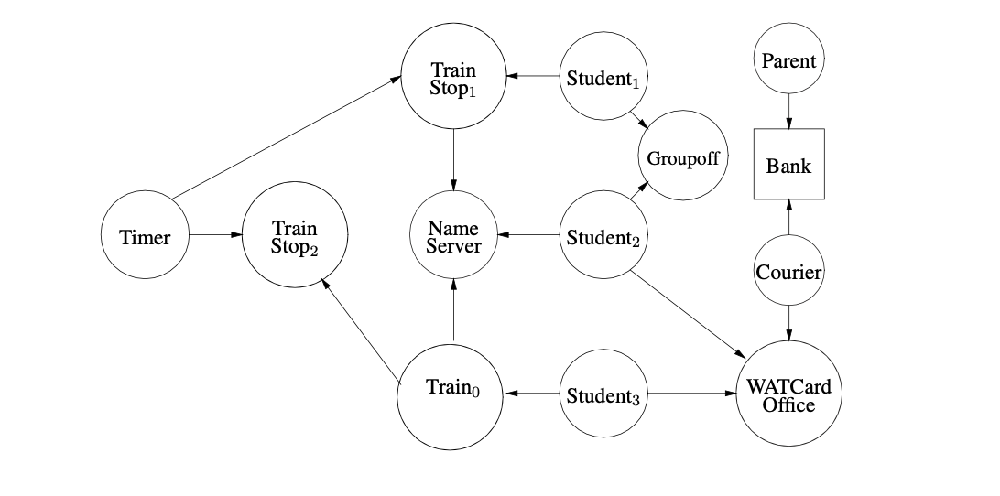
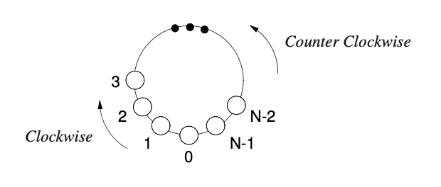

# concurrent-transit-system

## Created by [Meredith(Xinru) Cheng](https://www.linkedin.com/in/meredith-cheng/) and [Samuel Chen](https://www.linkedin.com/in/samuel-xiaoyang-chen/)

This project uses μC++ to facilitate task communication and incorporates high-level techniques such as synchronization, mutual exclusion and message passing to structure and manage complex interactions among concurrent tasks.

This project simulates the scenario such that as part of a tax evasion scheme, a billionaire UW alumnus has agreed to make a charitable donation to fund a local light-rail transit system between the various Waterloo campuses: University of Waterloo, Wilfrid Laurier, and Conestoga College. The route forms a loop, and there are two trains in service running continuously. One train runs in a clockwise direction, the other runs in a counter-clockwise direction.

It also simulates a simple train service using the objects and relationships in Figure 2. (Not all possible communication paths are shown in the diagram.)

